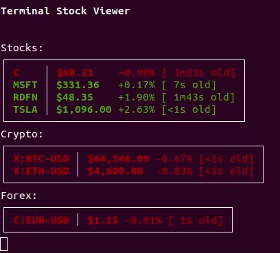

# terminal-stock-viewer




A stock (or crypto or forex) viewer for your terminal!

This is a toy that you can play with if you have a [polygon.io](polygon.io) API key already.

## Dependencies

- Java 11+ (it might work with older versions of Java, I haven't tried)
- A terminal that respects ANSI escape sequences (most do, but not all...)
- An API key from [polygon.io](https://polygon.io/pricing) that supports the real-time data you want (ie for stock  tickers, you'll need a stocks subscription, for crypto/fx you'll need a currencies subscription).

## Building

From the root of the repo, build an executable jar:
```bash
./gradlew jar
```

The jar should be in `build/libs/terminal-stock-viewer-1.0.jar

## Running

Make sure you've set the `POLYGON_API_KEY` environment variable to be your Polygon.io API key:
```bash
export POLYGON_API_KEY="your-polygon-api-key-here"
```

From the root of the repo, run the executable jar you just built with the list of tickers you want to subscribe to as arguments:
```bash
java -jar build/libs/terminal-stock-viewer-1.0.jar RDFN C MSFT X:BTC-USD C:EUR-USD
```

For more info on flags/options: 
```bash
java -jar build/libs/terminal-stock-viewer-1.0.jar --help
```
